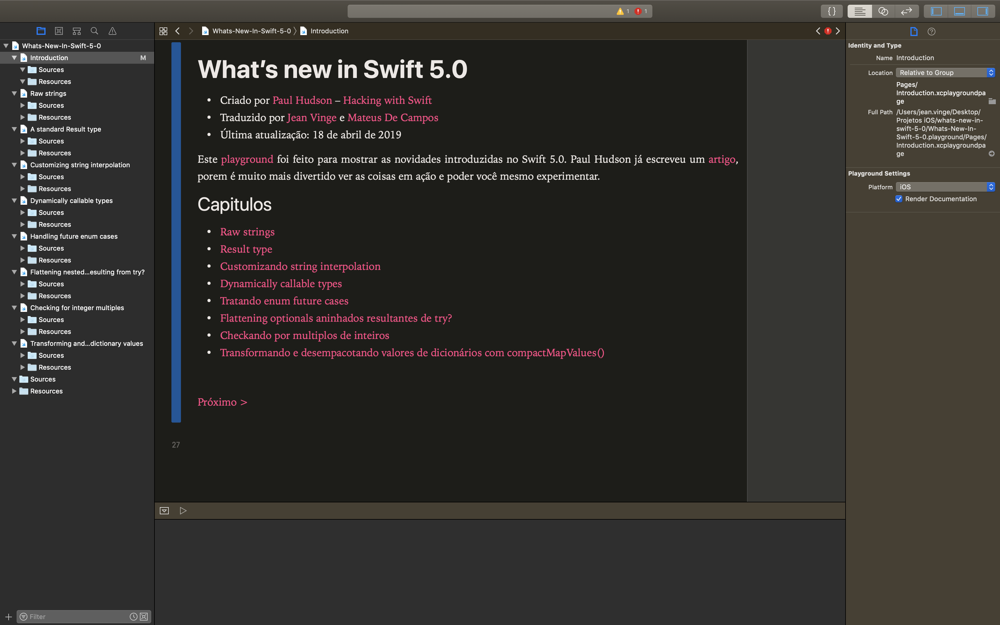

# What’s new in Swift 5.0?

Esse é um `XCode playground` que demonstra as novas funcionalidades introduzidas no Swift 5.0:

* Raw strings
* `Result` type
* Customizando string interpolation
* Dynamically callable types
* Tratando enum future cases
* Flattening optionals aninhados resultantes de `try?`
* Checkando por multiplos de inteiros
* Transformando e desempacotando valores de dicionários com `compactMapValues()`

Esse playground foi feito para complementar o artigo [What’s New in Swift 5.0](https://www.hackingwithswift.com/articles/126/whats-new-in-swift-5-0). Você pode ler também [What’s New in Swift 4.2](https://www.hackingwithswift.com/articles/77/whats-new-in-swift-4-2) e [What's New in Swift 4.1](https://www.hackingwithswift.com/articles/50/whats-new-in-swift-4-1). Alternativamente, eu existe um site inteiro dedicado a rastrear [what's new in Swift](https://www.whatsnewinswift.com) – você pode ver em <https://www.whatsnewinswift.com>.

Se você tiver algum problema ou pergunta,
If you hit problems or have questions, você está convidado para enviar um tweet [@twostraws](https://twitter.com/twostraws) ou email <paul@hackingwithswift.com>.

